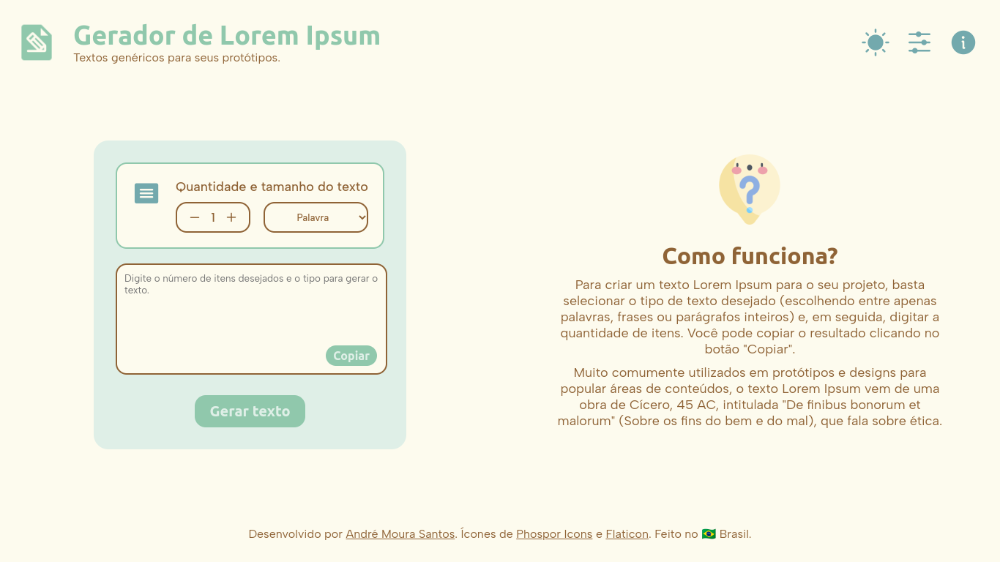
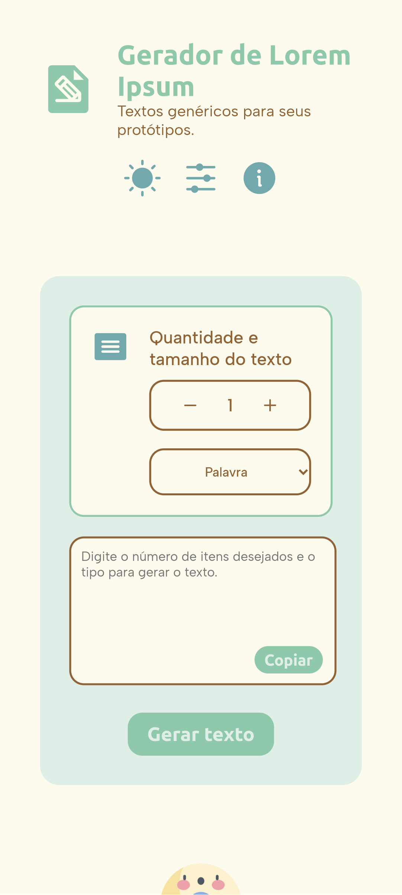
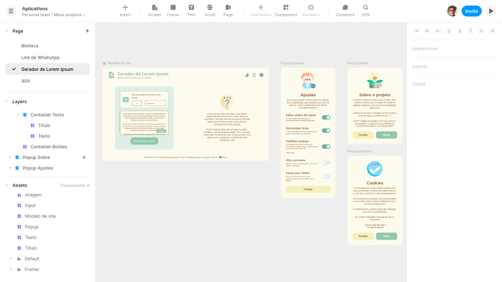

# Gerador de Lorem Ipsum
Uma simples ferramenta para criar textos de Lorem Ipsum para popular áreas de conteúdo em protótipos e designs.

> Durante a criação de protótipos ou wireframes de projetos, eu me encontrei pesquisando por geradores de Lorem Ipsum a todo momento. Então, decidi criar um próprio para treinar minhas habilidades.

- - - 

## O que aprendi com esse projeto? 🎯
- Utilizar componentes em meus wireframes para acelerar o processo de criação.
- Utilizar uma biblioteca de ícones de terceiros em meus projetos.
- Criar interações mais lógicas para funções que já havia utilizado.
- Aprofundei meus conhecimentos no uso da declaração Switch e na identificação de bons casos de uso.

- - - 

## Log

- **Atualização 1.1**
    - Adicioando PUAU.
    - Adicionado o atributo title para os principais botões da página.
    - Agora os arquivos universal.css e essencial.js foram removidos sendo importados do site principal.
    - Agora os ícones Kawaii são importados do site principal.
    - Foto de capa atualizada.

- **Atualização 1.0**
    - Lançamento da ferramenta.
    - Criação do README.md.
    - Criação da logo e foto de capa do projeto.

- **Alpha 1.3**
    - Adicionado atalho de teclado.
    - Adicionado novas interações para aumentar ou diminuir a de quantidade de texto.
    - Adicionados popups de boas-vindas e novidades da versão.
    - Corrigido bug de alternância incorreta de cor da barra do navegador com o tema da página.
    - Criação de um objeto para melhor organizar as informações da ferramenta (utilizadas pelo essencial.js).
    - Ferramenta em estado de uso.
    - Finalizada responsividade.
    - Finalizado conteúdo dos popups e da página.
    - Finalizado script da página.

- **Alpha 1.2**
    - Agora o botão para gerar texto está funcional!
    - Corrigida pequena falha no index.css que prejudicava a visualização do botão na segunda posição do cabeçalho.
    - Criação de textos funcionando parcialmente (Seletor de "palavra" com problemas).
    - Removido arquivo essencial.css (incorporado pelo universal.css).

- **Alpha 1.1**
    - Adição da responsividade.
    - Adição do script da biblioteca de ícones Phosphor.
    - Otimização do código.
    - Remoção de imagens não mais necessárias.

- **Alpha 1.0**
    - Início da prototipação.
    - Criação do wireframe.
    - Inserção dos contêineres dos conteúdos.
    - Inserção dos itens de interação.

- - -

## Imagens do projeto 📸
Confira as imagens do projeto, que representam a sua versão mais recente.

  

  
